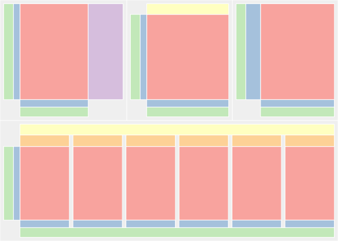
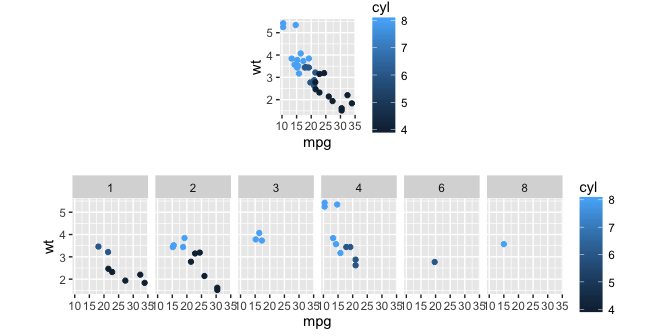
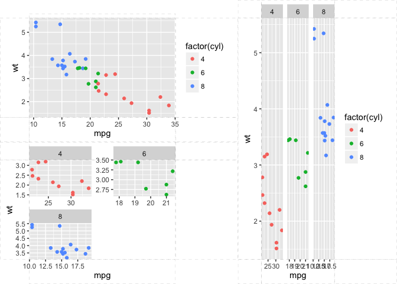

egg
===

Misc. doomed tricks for ggplot2.

Exposing ggplot2 layouts
------------------------

``` r
p1 <- qplot(mpg, wt, data=mtcars, colour=cyl)
p2 <- qplot(mpg, data = mtcars) + ggtitle("title")
p3 <- qplot(mpg, data = mtcars, geom = "dotplot")
p4 <- p1 + facet_wrap(~carb, nrow=1) + theme(legend.position="none") +
  ggtitle("facetted plot")
pl <- lapply(list(p1,p2, p3, p4), expose_layout, FALSE, FALSE)
```

    ## `stat_bin()` using `bins = 30`. Pick better value with `binwidth`.

    ## `stat_bindot()` using `bins = 30`. Pick better value with `binwidth`.

``` r
grid.arrange(grobs=pl, widths=c(1.2,1,1),
             layout_matrix = rbind(c(1, 2, 3),
                                   c(4, 4, 4)))
```

<!-- -->

Setting panel size
------------------

``` r
p1 <- qplot(mpg, wt, data=mtcars, colour=cyl)
p2 <- p1 + facet_wrap(~carb, nrow=1) 
grid.arrange(grobs=lapply(list(p1,p2), set_panel_size))
```

<!-- -->

Aligning complex ggplots
------------------------

``` r
p1 <- ggplot(mtcars, aes(mpg, wt, colour = factor(cyl))) +
  geom_point() 

p2 <- ggplot(mtcars, aes(mpg, wt, colour = factor(cyl))) +
  geom_point() + facet_wrap( ~ cyl, ncol=2, scales = "free") +
  guides(colour="none") +
  theme()

p3 <- ggplot(mtcars, aes(mpg, wt, colour = factor(cyl))) +
  geom_point() + facet_grid(. ~ cyl, scales = "free")

g1 <- ggplotGrob(p1);
g2 <- ggplotGrob(p2);
g3 <- ggplotGrob(p3);
fg1 <- gtable_frame(g1)
fg2 <- gtable_frame(g2)
fg12 <- gtable_frame(rbind(fg1,fg2), width=unit(2,"null"), height=unit(1,"null"))
fg3 <- gtable_frame(g3, width=unit(1,"null"), height=unit(1,"null"))
grid.newpage()
combined <- cbind(fg12, fg3)
combined <- gtable_add_grob(combined, rectGrob(gp=gpar(fill="grey98", alpha=0.5, lty=2, lwd=1.5)),
                            l=2, r=5, t=2, b=2, z=Inf, name="debug")
grid.draw(combined)
```

<!-- -->
